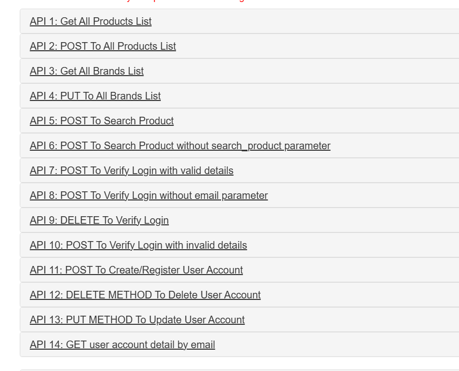

# Automation Exercise API Test Projesi

Bu testler, [https://automationexercise.com](https://automationexercise.com) sitesi tarafından sağlanan API için hazırlandı.

## Test Senaryoları
Automation Exercise tarafından hazırlanmış olan test senaryoları kullanıldı.



## 📁 Klasör Yapısı

```text
.
├── config/                   # API endpoint sabitleri
├── data/                     # Test verilerini içeren JSON dosyaları
├── helpers/                 # Yardımcı fonksiyonlar (örneğin request handler)
├── tests/
│   ├── test_account_status.py       # Kayıt, giriş, güncelleme ve silme testleri
│   ├── test_check_products.py       # Ürün listeleme ve içerik doğrulama testleri
│   └── test_negative.py             # Negatif test senaryoları (404, 405, invalid data vb.)
├── conftest.py              # Fixture’lar ve ortak yapılandırmalar
├── README.md


## Kullanılan Teknolojiler
- **Python 3**
- **Request**
- **Pytest**


